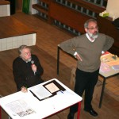
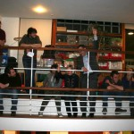
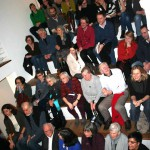
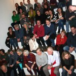
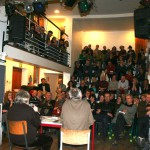
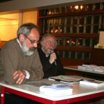
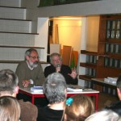

Henry Landroit, co-fondateur et directeur de l’école durant de longues années, a écrit un livre retraçant l’histoire de celle-ci.

« Histoire de l’autre école » couvre la période de 1973 à 1996 et comprend un DVD avec quelques courts films.

Ce mardi 30 janvier a eu lieu une présentation du livre sous forme de débat avec Henry et Abel Debrue, un psychopédagogue de Mons. De nombreux anciens élèves, parents (dont certains parents fondateurs) et membres de l’équipe ancienne et actuelle étaient présents pour participer au débat et échanger sur l’école. Une soirée agréable et festive.

      