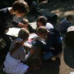

Le lundi après-midi, les enfants de la 2° maternelle à la 6° primaire  s’inscrivent à une série d’ateliers. Voici quelques photos de l’atelier ‘insecte: de l’observation à la création’. Les enfants sont partis à la recherche d’insectes et en observent les caractéristiques. #gallery-26 { margin: auto; } #gallery-26 .gallery-item { float: left; margin-top: 10px; text-align: center; width: 33%; } #gallery-26 img { border: 2px solid #cfcfcf; } #gallery-26 .gallery-caption { margin-left: 0; } /\* see gallery\_shortcode() in wp-includes/media.php \*/

  

  

