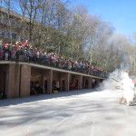
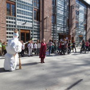
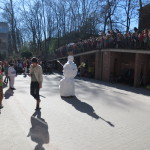
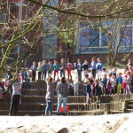
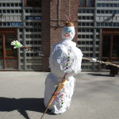

#gallery-24 { margin: auto; } #gallery-24 .gallery-item { float: left; margin-top: 10px; text-align: center; width: 33%; } #gallery-24 img { border: 2px solid #cfcfcf; } #gallery-24 .gallery-caption { margin-left: 0; } /\* see gallery\_shortcode() in wp-includes/media.php \*/

  

  

Pour célébrer l’arrivée du printemps, nous avons brulé bonhomme hiver ce jeudi 20 mars. Les deuxièmes, troisièmes et sixièmes ont cuisiné pour le goûter et 4 enfants par classe ont réalisé une danse avec l’aide de Zénon. Les maternelles ont aussi inventé une chanson qu’ils ont chantée à toute l’école… la fête fut des plus réussies! Bravo à tous et merci aux parents présents.