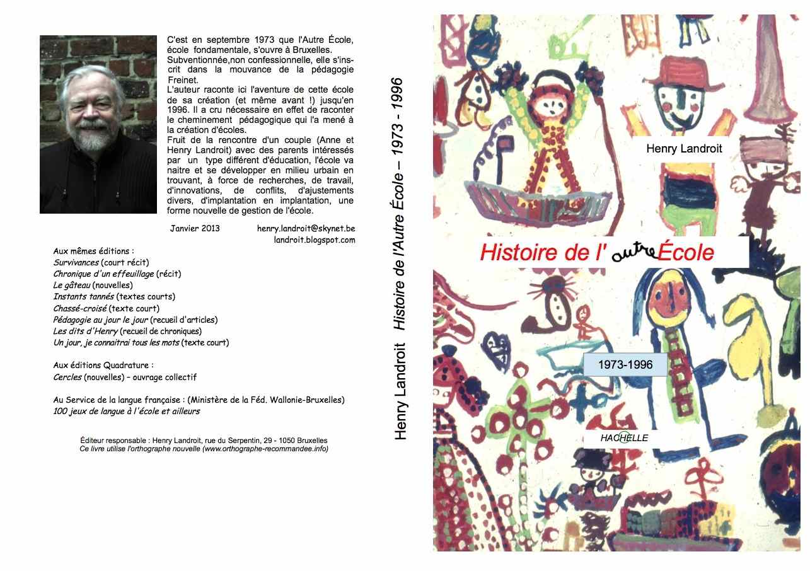

Vous connaissez probablement Henry Landroit, l’un des fondateurs de l’Autre école qui fut aussi son directeur durant de longues années. Henry a écrit, il y a quelque temps, un livre sur l’histoire de l’école de 1973 à 1996.

Il vous propose de le consulter gracieusement sur un tourne-page dont voici l’adresse :

[http://www.wobook.com/WB5D5BF19C2a](http://www.wobook.com/WB5D5BF19C2a)

