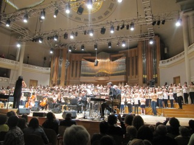

Dans le cadre du projet Cantania, la classe de cinquième (Micheline) a chanté au Palais des Beaux-Arts. Il y ont travaillé toute l’année avec Fanny. Bravo à eux pour leur audace et la qualité de leur prestation

](./IMG_9542-Z4u41c0yjOqJ.jpeg)
