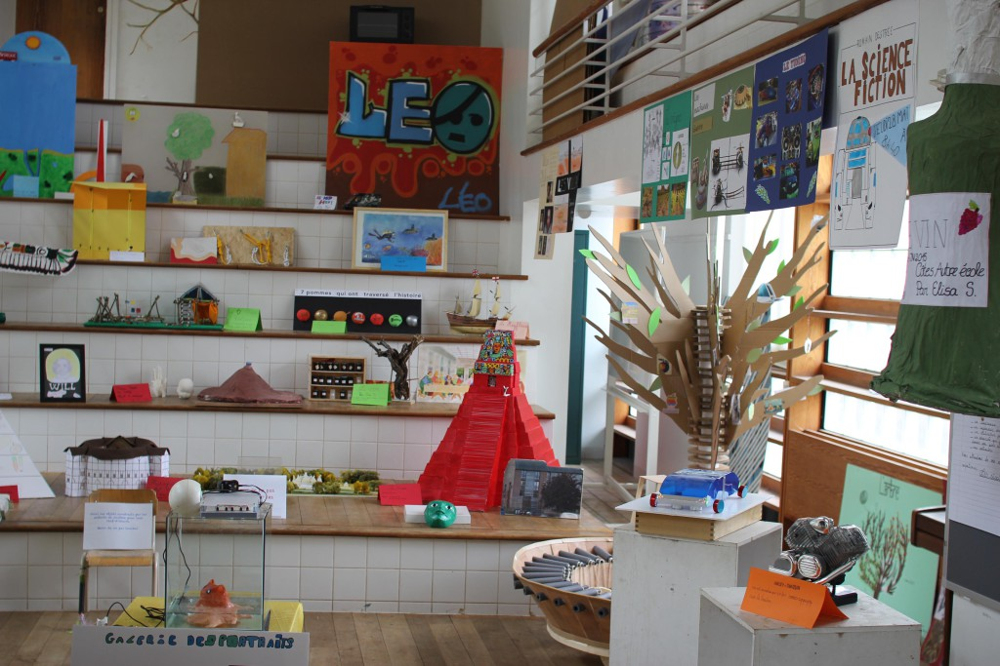
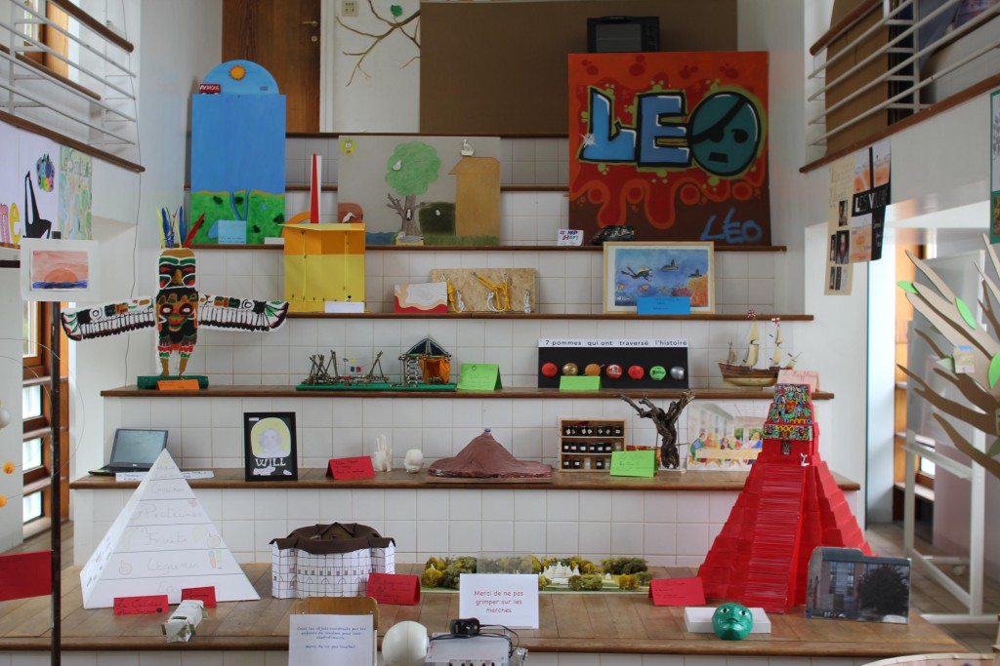

Les objets réalisés par les sixièmes, dans le cadre de leur chef-d’oeuvre.

#gallery-17 { margin: auto; } #gallery-17 .gallery-item { float: left; margin-top: 10px; text-align: center; width: 50%; } #gallery-17 img { border: 2px solid #cfcfcf; } #gallery-17 .gallery-caption { margin-left: 0; } /\* see gallery\_shortcode() in wp-includes/media.php \*/

