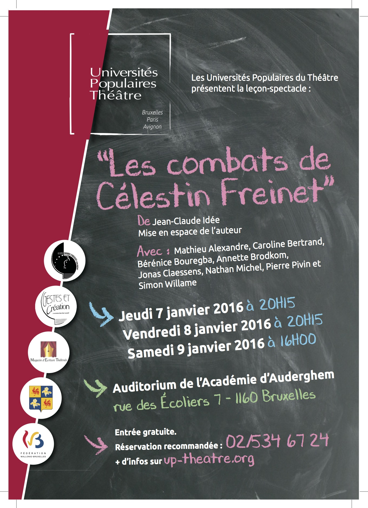

Les Universités populaires du Théâtre, en collaboration avec L’Autre école et de l’Autre côté de l’école, vous invitent le 7, le 8 ou le 9 janvier…réservez!

Une occasion à ne pas manquer pour découvrir l’homme derrière la pédagogie. Jean-Claude Idée a effectué un travail de recherche sur la pensée de Célestin Freinet qui est remarquable. Merci à lui!

[Universités Populaires du Théâtre](http://www.up-theatre.org/events/les-combats-de-celestin-freinet-a-lacademie-dauderghem/)