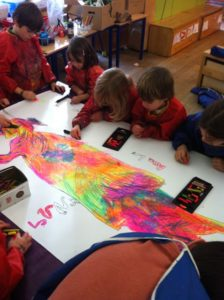
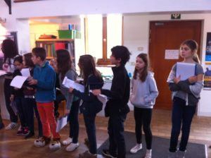

Chaque année la semaine du 6 décembre, tous les enfants de l’école participent à un grand jeu coopératif en équipes multi-âge.

Dans la coopération et l’entraide, chaque équipe se déplace en autonomie dans le bâtiment et participe à différentes activités.

Une énigme clôture toujours ce moment festif et toute l’école appelle alors en chanson les gardiens du trésors (la classe des plus jeunes).

<video class="wp-video-shortcode" id="video-1014-1" width="480" height="853" preload="metadata" controls="controls"><source type="video/mp4" src="IMG_7768-foMrnPgdWQYp.m4v"><a href="http://www.autre-ecole.org/wp-content/uploads/2016/12/IMG_7768.m4v">http://www.autre-ecole.org/wp-content/uploads/2016/12/IMG_7768.m4v</a></video>