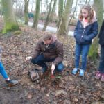

#gallery-11 { margin: auto; } #gallery-11 .gallery-item { float: left; margin-top: 10px; text-align: center; width: 33%; } #gallery-11 img { border: 2px solid #cfcfcf; } #gallery-11 .gallery-caption { margin-left: 0; } /\* see gallery\_shortcode() in wp-includes/media.php \*/

  

Toutes les classes sont responsables d’un nichoir.

Cette semaine, nous sommes allés vérifier si les nichoirs étaient occupés.

Dans le nôtre (les sixièmes), nous avons pu observer qu’il y avait un nid, mais qu’il n’y avait pas eu d’oeufs. Nous l’avons ensuite nettoyé.