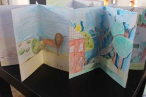
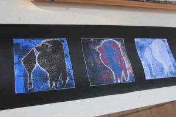

Il n’est jamais trop tard…voici des photos de la clôture d’une série d’ateliers du lundi du mois de février. Ces ateliers, qui regroupent des enfants de la 3e maternelle à la sixième primaire durent 5 après-midi et les groupes qui le souhaitent peuvent présenter le fruit de leur travail sous des formes variées.

Ce diaporama nécessite JavaScript.