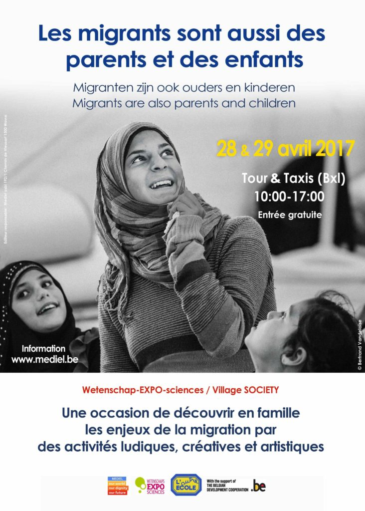

L’école participe à un magnifique projet sur la migration dans le cadre de l’Expo Sciences à Tours et Taxi ce vendredi 28 avril et ce samedi 29 avril.

Venez-nous rejoindre et tenter notre parcours des migrants!

Partagez l’info autour de vous!

[Affiche Migration A4 AUTRE ECOLE](http://www.autre-ecole.org/2017/04/24/vendredi-et-samedi-exposition-sur-la-migration/affiche-migration-a4-autre-ecole/)