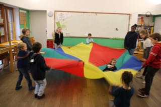
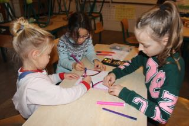

Ce mercredi était le jour de la célèbre fête des enfants.

Pendant cette matinée, les enfants sont répartis en petits groupes d’âges mélangés (de la première maternelle – seulement ceux des classes verticales – à la sixième primaire), ils circulent dans l’école en suivant un itinéraire précis et ils participent à différentes activités ludiques et créatives pendant toute la matinée.

A l’école, nous choisissons d’organiser cette matinée qui développe le plaisir d’être ensemble, la coopération et la joie de vivre plutôt que de faire venir le fameux grand barbu du 6 décembre.

Cette fête des enfants était une vraie réussite!

Ce diaporama nécessite JavaScript.