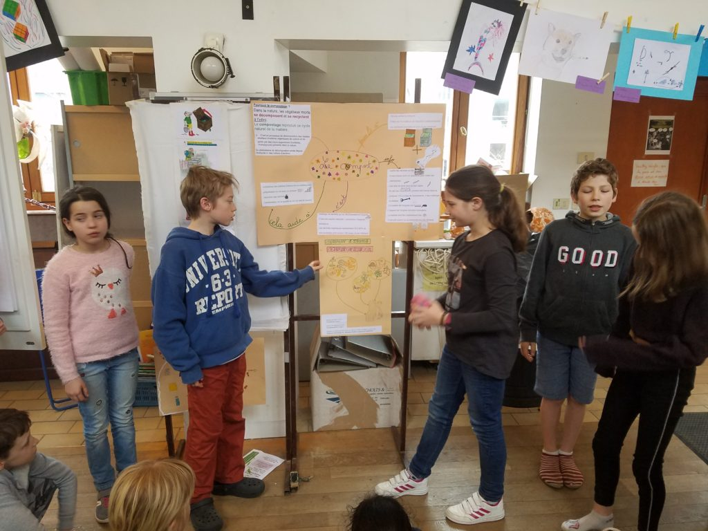
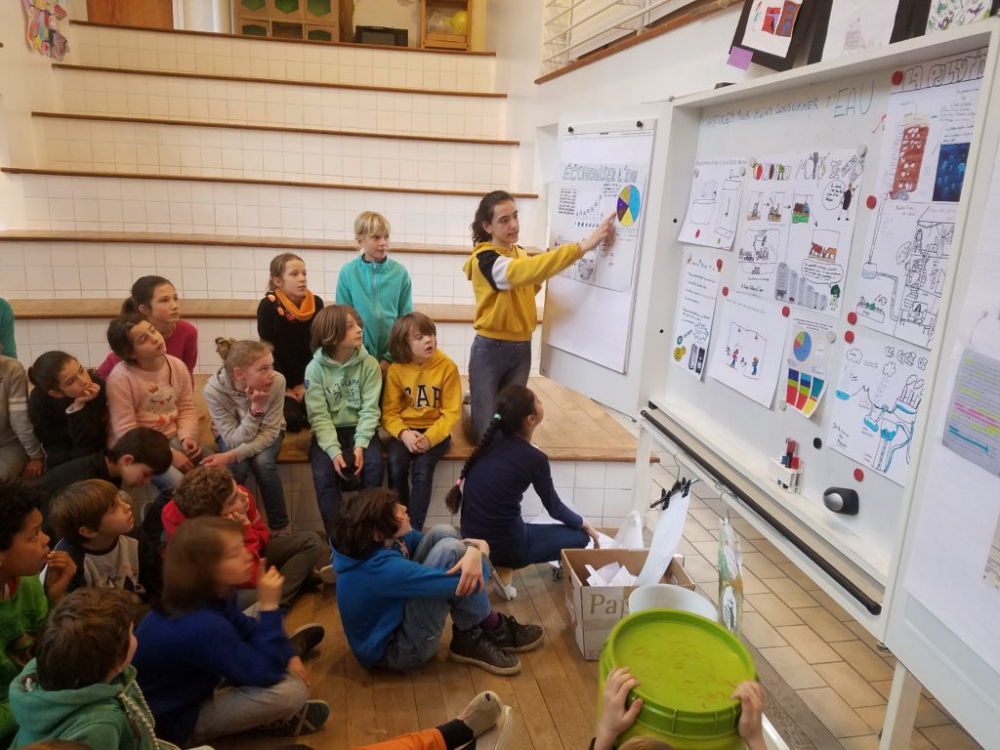
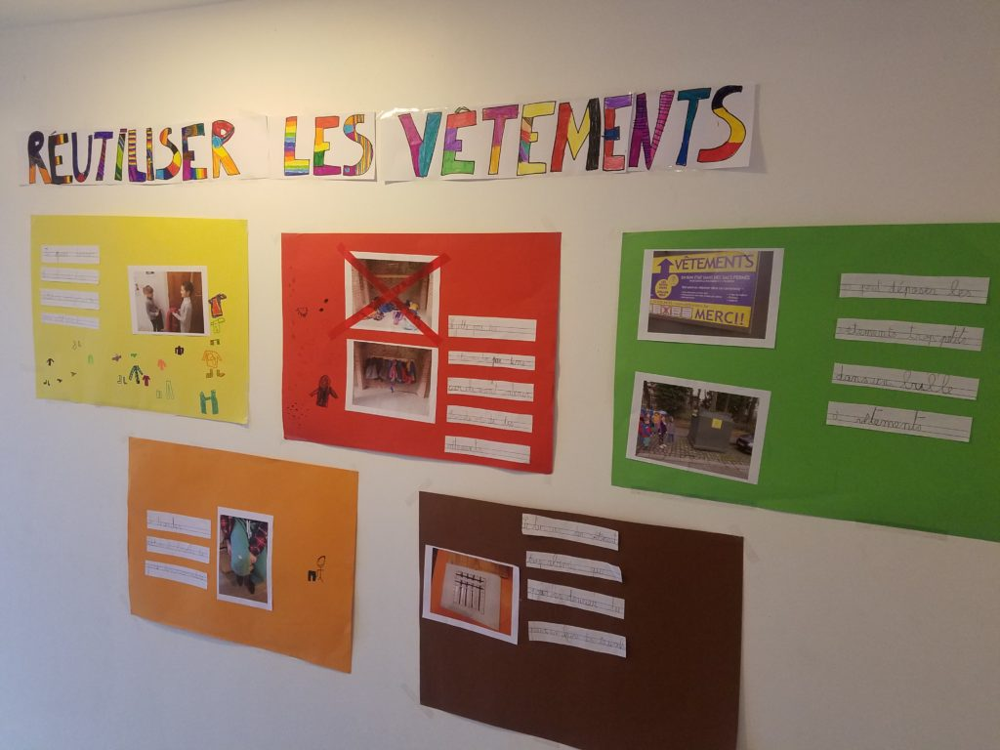
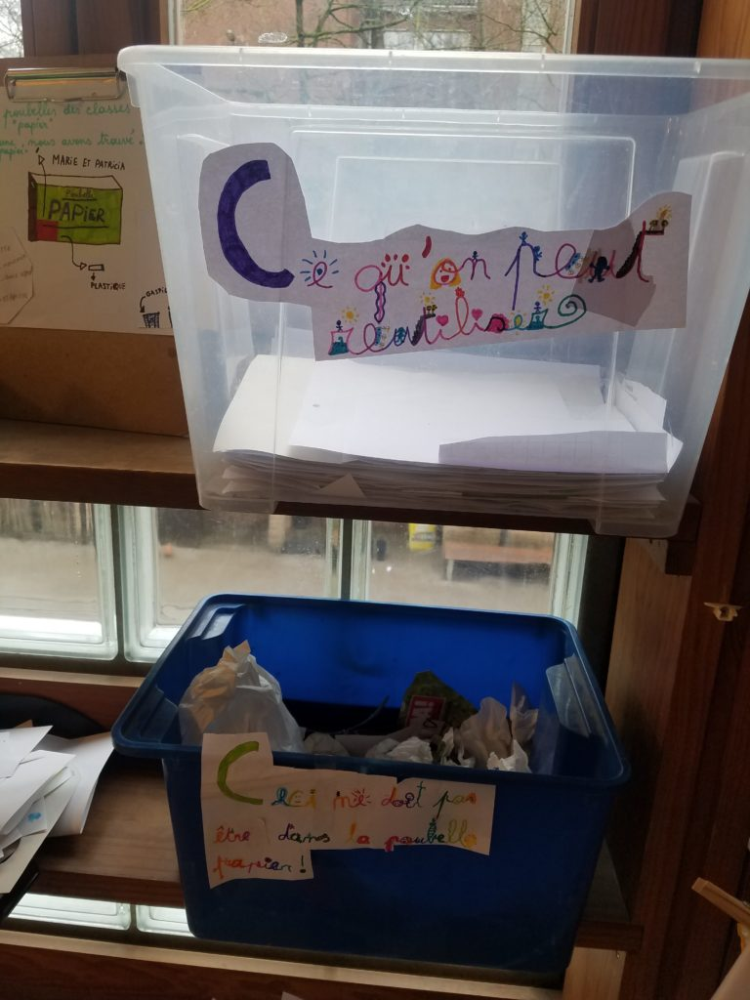
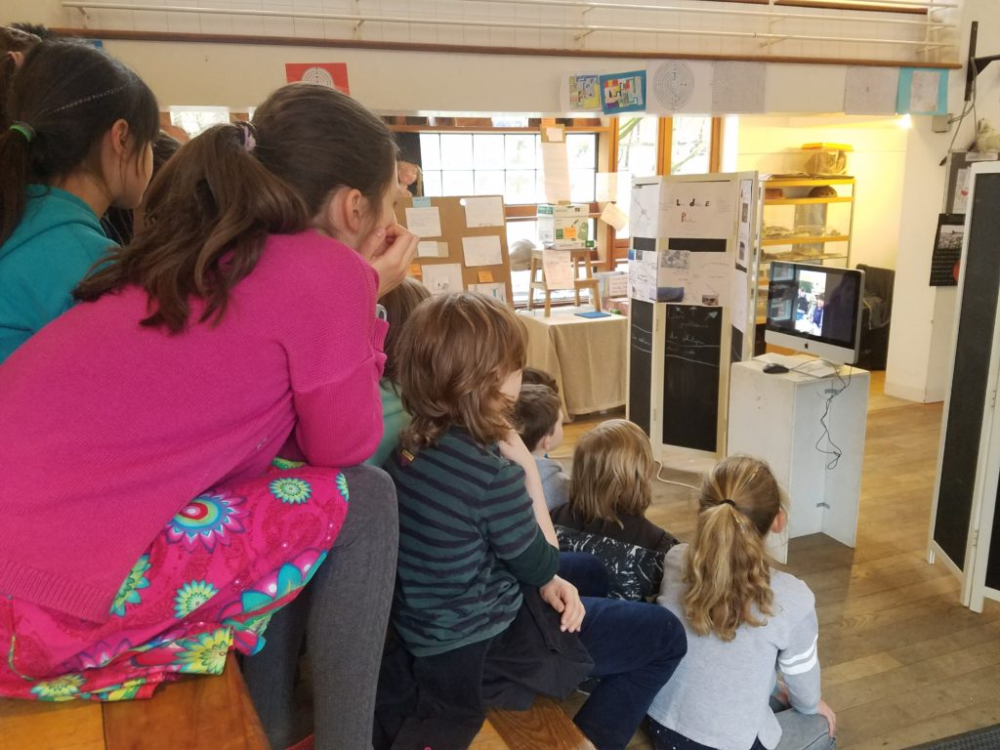
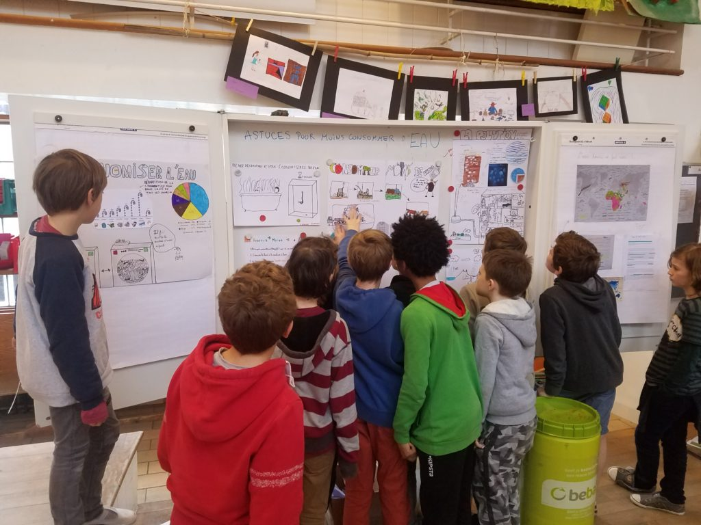

L’idée est partie d’un conseil d’école: devenir une école zéro déchet. Chaque classe s’est appropriée un thème: le plastique, l’eau, les vêtements, la nourriture, le papier, etc. Le but était de proposer des pistes concrètes et de sensibiliser les élèves, parents, animateurs à consommer moins.

L’expo est accessible jusqu’au jeudi 4 avril au Forum.

#gallery-1 { margin: auto; } #gallery-1 .gallery-item { float: left; margin-top: 10px; text-align: center; width: 33%; } #gallery-1 img { border: 2px solid #cfcfcf; } #gallery-1 .gallery-caption { margin-left: 0; } /\* see gallery\_shortcode() in wp-includes/media.php \*/

  

