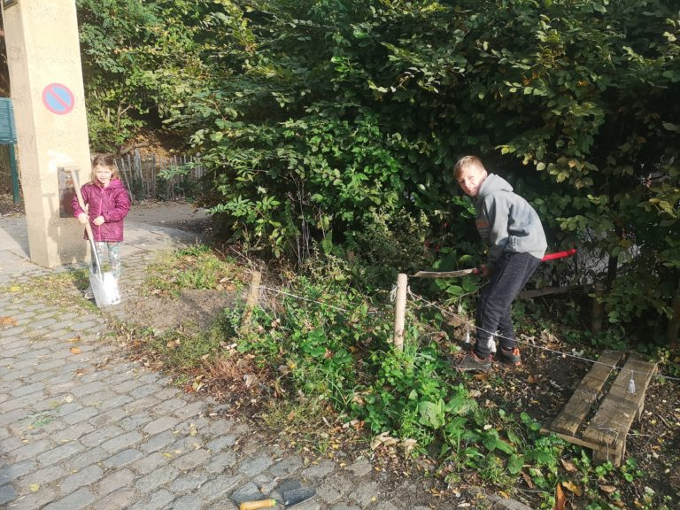
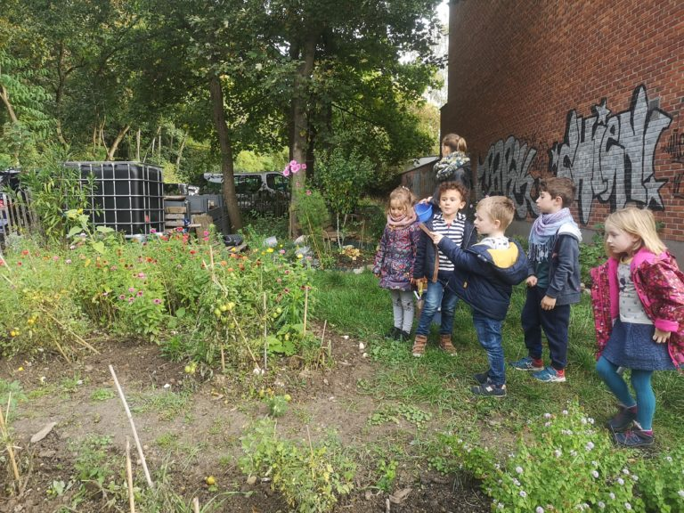

Comme tous les lundis, un petit groupe d’élèves de la maternelle à la 6e primaire a travaillé dans les espaces verts qui entourent l’école avec l’aide de Véronique, l’animatrice des petits. Une activité d’une période en multiâge pour découvrir les joies du jardinage.

