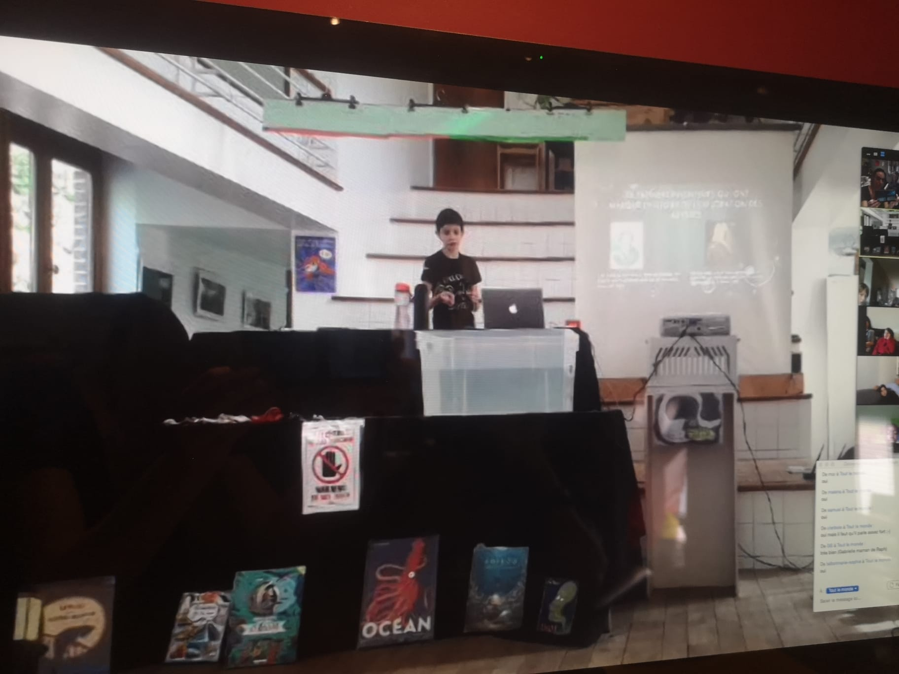
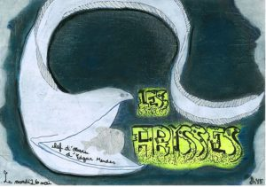
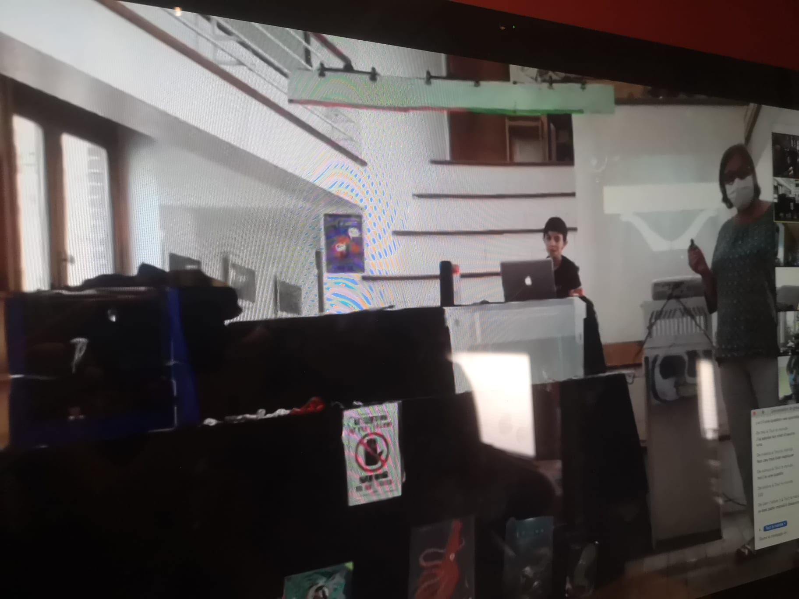

Un moment important qui clôture le cycle primaire à l’Autre école est le « Chef d’œuvre ». Les enfants qui terminent leur parcours à l’Autre école présentent donc le résultat d’un travail de recherche, d’expérimentations de toute une année. Cette présentation par l’enfant se fait en général devant les classes de 5e et 6e, devant quelques autres élèves de l’école intéressés par le sujet, devant ses parents, son parrain de chef d’oeuvre, devant 2 ou 3 animateurs et parfois devant d’autres invités que l’enfant accepte à sa présentation.

Malgré cette période particulière, nous avions à coeur de permettre aux enfants de 6e primaire de présenter ce travail de l’année. Les règles de distanciation sociale et de silos en vigueur nous ont obligés à chercher des solutions créatives. Les animateurs de 5e/6e ont retroussé leurs manches et cherché des solutions techniques qui permettraient aux enfants intéressés et aux familles de suivre ces présentation depuis chez eux. Ce fut un succès!

LES ABYSSES… C’est le sujet du premier chef d’œuvre qui a eu lieu cette semaine. Edgar nous a captivé en nous parlant des fonds marins, en nous partageant une expérience sur les ballasts et la poussée d’Archimède, le tout à l’aide de schémas, d’extraits audios et vidéo. Bravo à lui!

