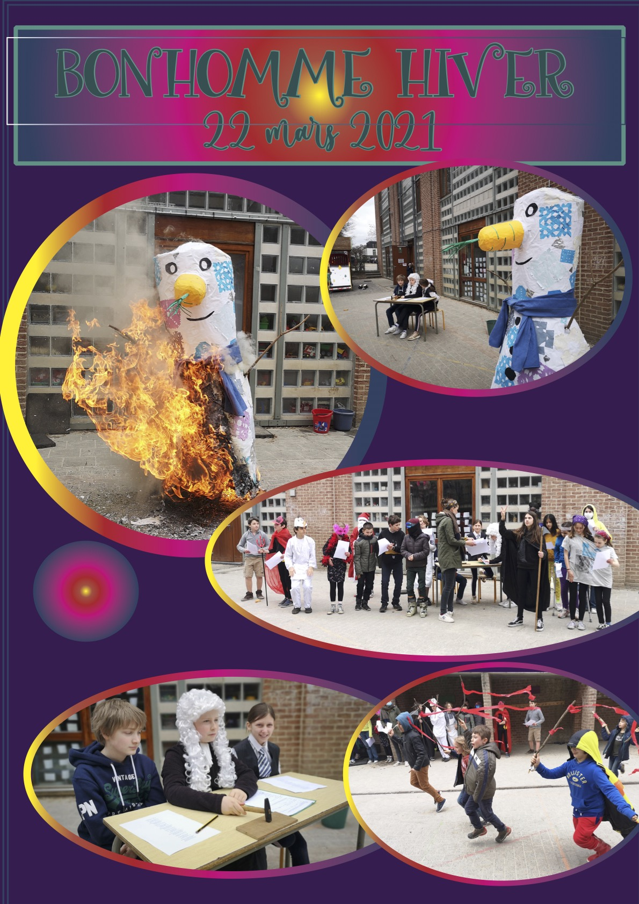

C’est une tradition à l’autre Ecole de fêter la fin de l’hiver et d’accueillir le printemps en chansons. Cette année, il nous semblait plus important que jamais de maintenir ces rituels qui rythment le parcours des enfants à l’Autre école. Certes, nous n’avons pas pu préparer la fête en ateliers qui mélangent des enfants des différentes classes comme nous le faisons d’habitude mais ce fut une belle fête!

Les 1e/2e ont fabriqué bonhomme hiver. Les 6e nous ont préparé un superbe procès du bonhomme hiver. Malgré les convaincantes plaidoiries de la défense, il fut condamné à brûler pour laisser la place au printemps.

Les enfants de 3e et 4e lui ont dit adieu en voix et en mouvement et tous ensemble nous avons chanté pour la mise à feu.

