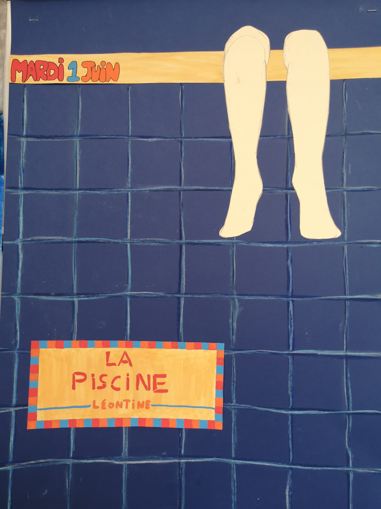

Les enfants de fin de 6e commencent à présenter leur chef d’oeuvre en cette fin d’année. C’est Malena qui a ouvert la danse avec brio en nous présentant son chef d’oeuvre sur la cuisine de l’Afrique de l’Ouest.

Pour faire la publicité de l’événement, les enfants ont réalisé des affiches qui sont exposées au forum.

En voici quelques unes :

-   
    
-   
    
-   
    
-   
    
-   
    
-   
    
-   
    
-   
    
-   
    
-   
    
-   
    
-   