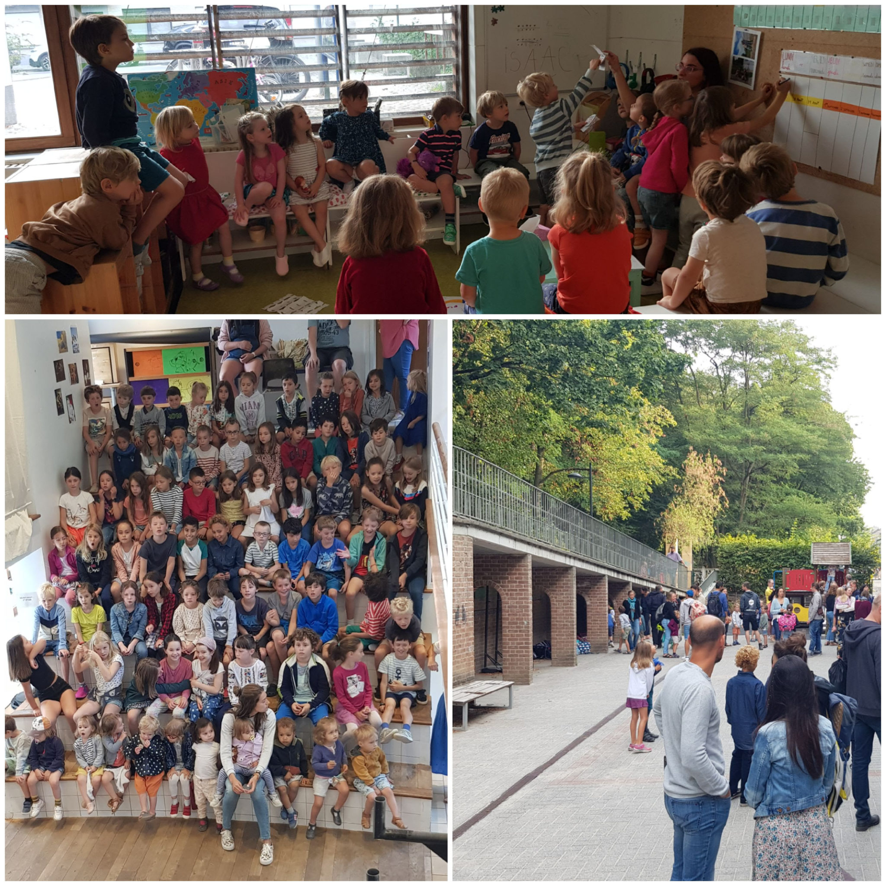
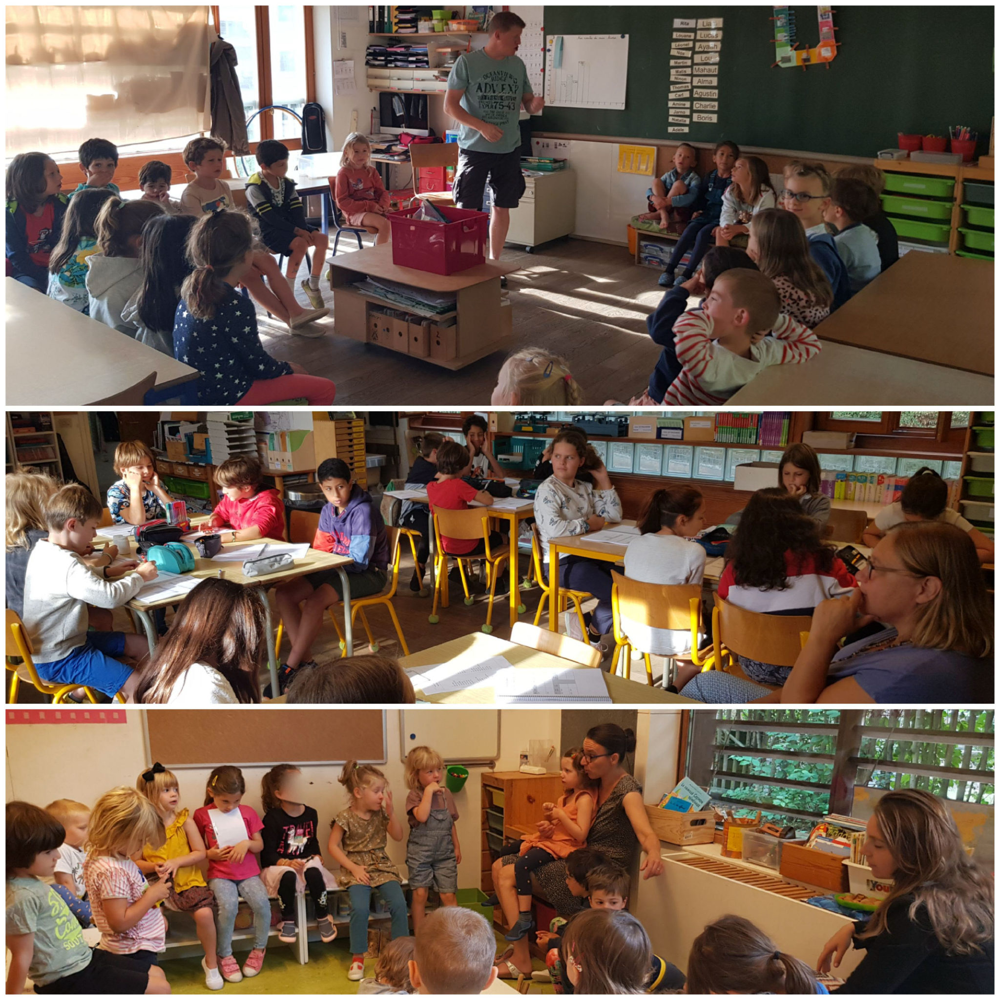
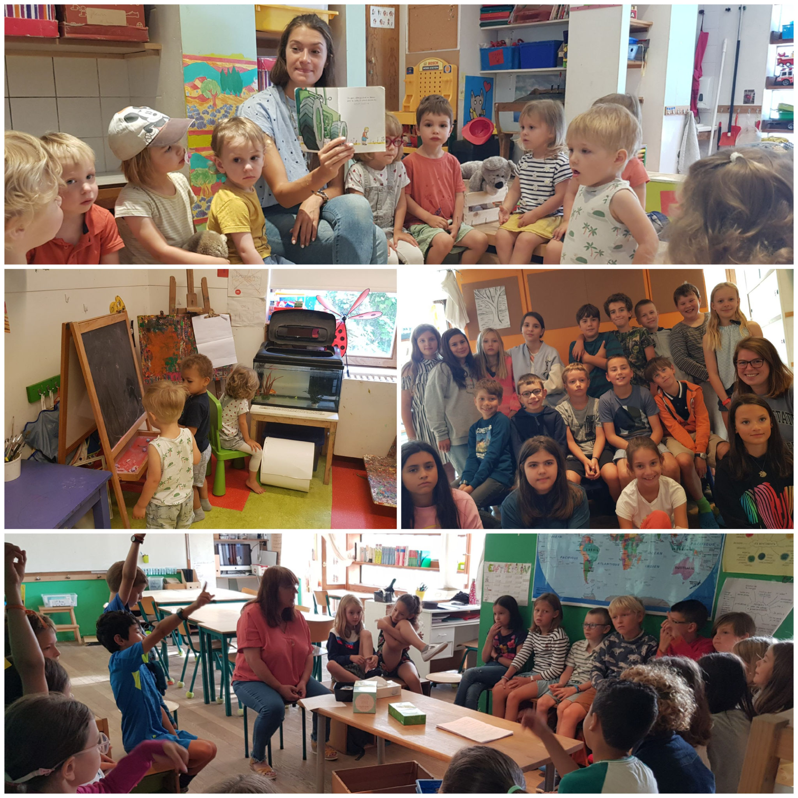
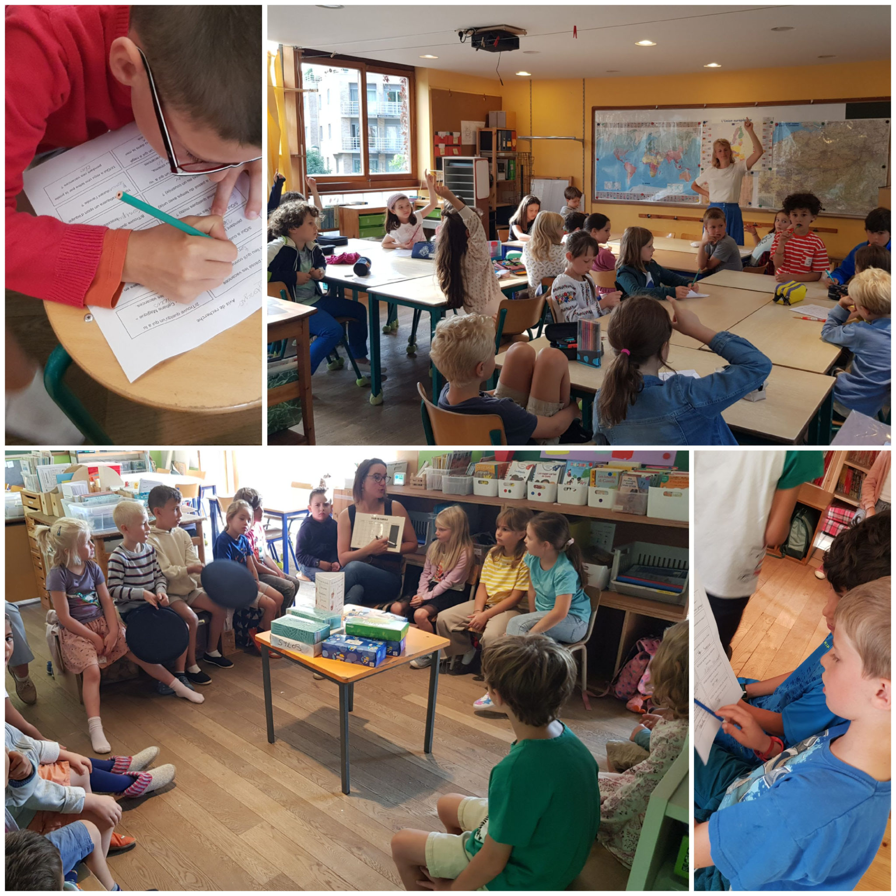

Depuis lundi passé, l’école reprend son activité. Beaucoup de rires, de sourires ; quelques pleurs éphémères chez les plus petits…

Les premiers cercles de parole de l’année ont eu lieu. Chacun s’est approprié sa classe, son nouveau groupe. 

Dès le premier jour, tout le monde s’est retrouvé au forum pour se souhaiter une bonne rentrée et fêter les premiers anniversaires de l’année.

Voici quelques clichés de cette première journée.

