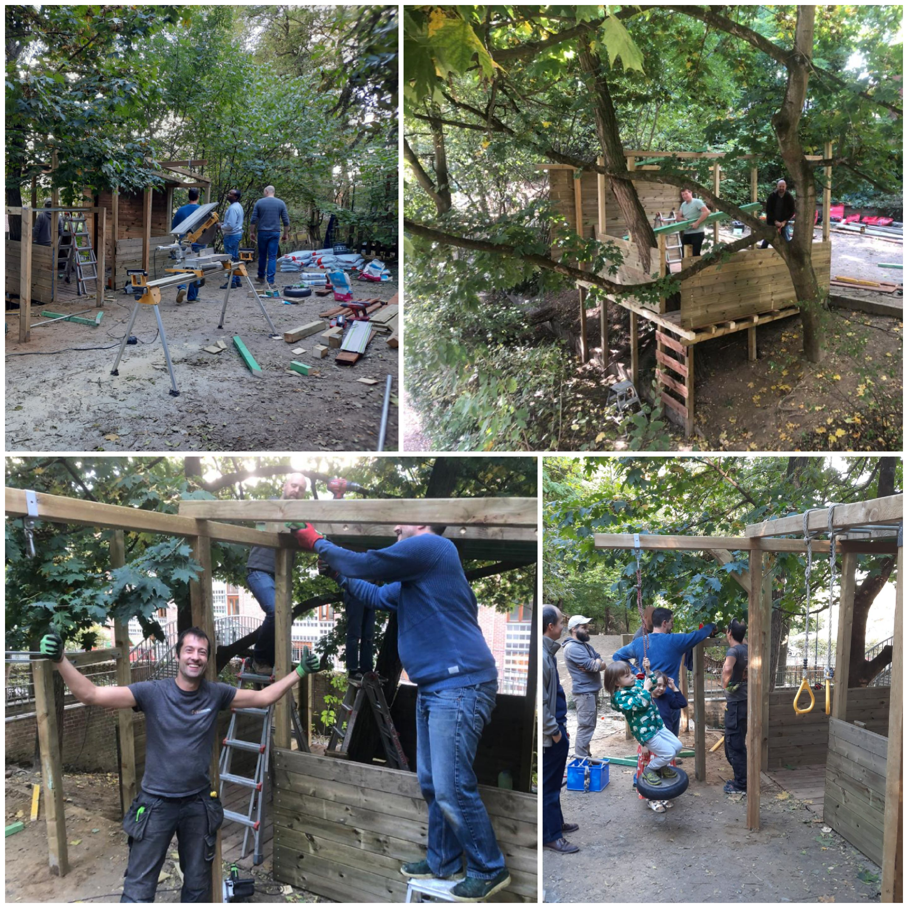
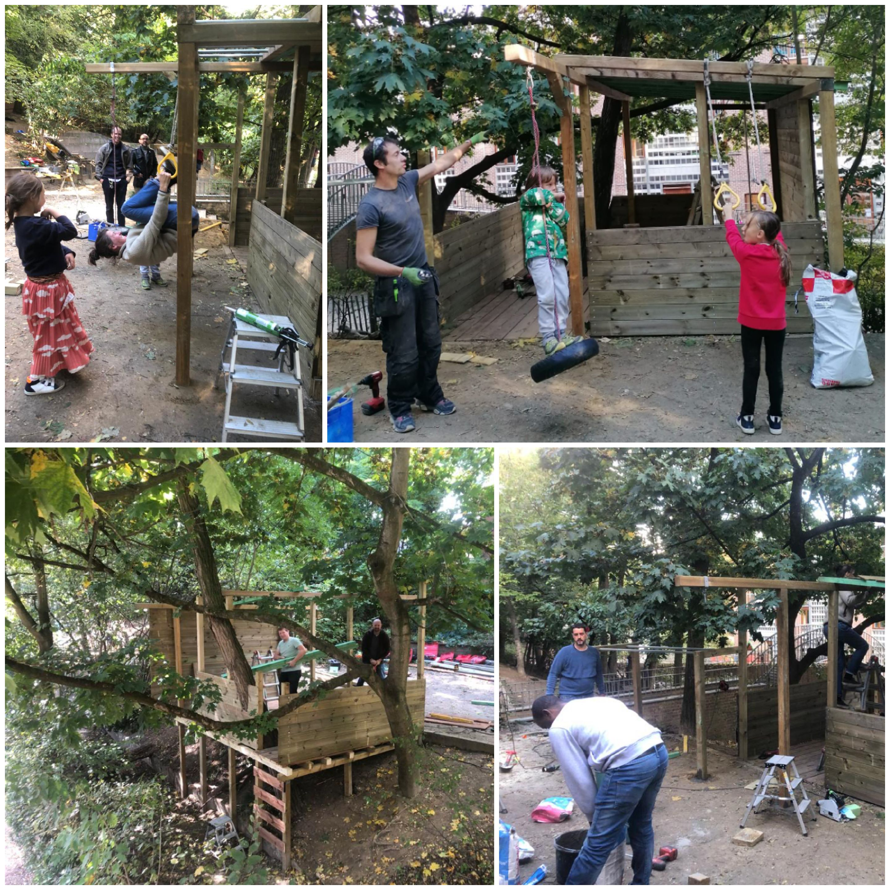

<table><tbody><tr><td>Si vous n’avez pas encore eu la chance de vous balader dans le terrain ou de l’apercevoir à partir de la promenade verte, voici quelques clichés de la Cabane.De sa construction à son exploitation.&nbsp;Pour certains enfants, il s’agit de l’aboutissement d’un projet débuté il y a 4 ans déjà.</td></tr></tbody></table>

<table><tbody><tr><td></td></tr></tbody></table>

<table><tbody><tr><td></td></tr></tbody></table>