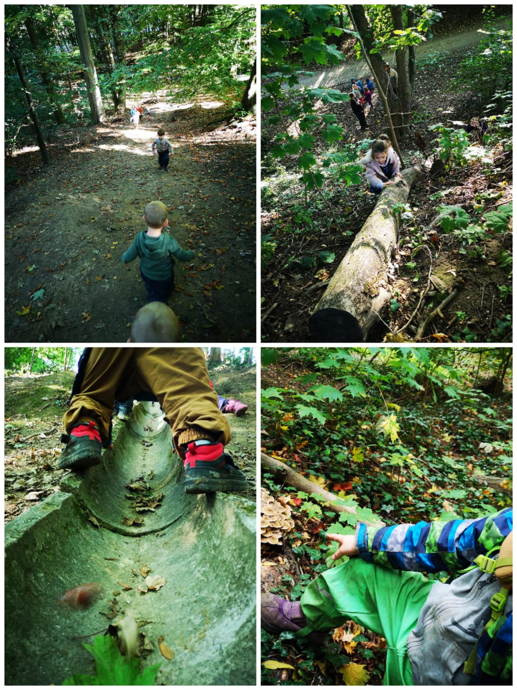

A l’école, les classes maternelles sortent régulièrement (sorties nature, vélo, théâtre, piscine, …).

Les 2 classes verticales des plus grands sortent en forêt (en zone boisée d’un parc) presque chaque semaine et par tous les temps. La plupart du temps, toute une journée mais le froid ou la pluie nous contraint à rentrer plus tôt. Une belle aventure qui s’inscrit dans la tradition des classes promenades de Freinet et dans ce qu’on appelle aujourd’hui « L’école du dehors ».

