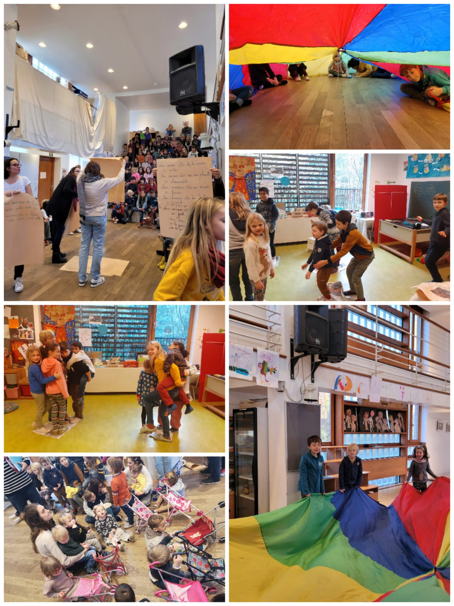
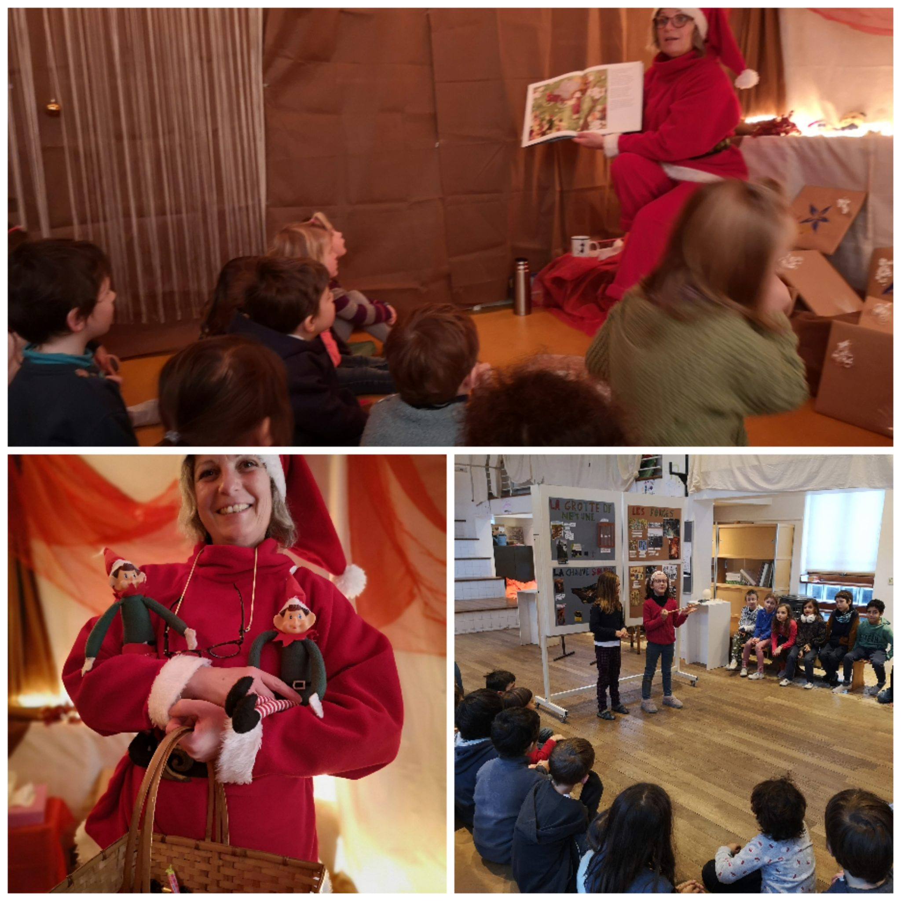
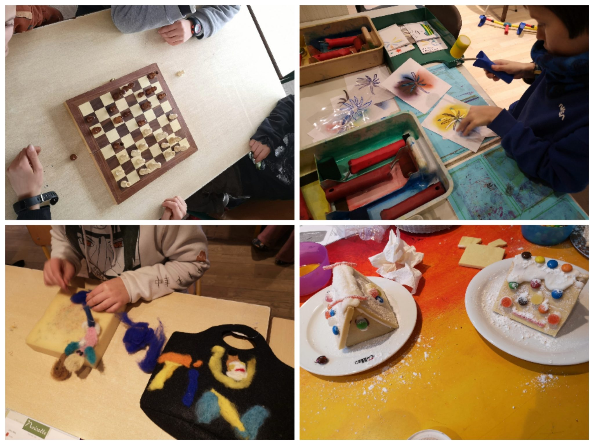

L’année s’est terminée avec plein de moments collectifs et partagés au sein de l’école.

Les classes de 1ère et 2ème primaire ont présenté leur exposition sur les classes vertes aux autres classes de l’école. Une longue présentation dynamique et pleine de vie qui a passionné petits et grands.

Une série d’ateliers du lundi, qui regroupe des enfants de la 3e maternelle à la 6e primaire, s’est clôturée fin du mois. Des échecs à la cuisine en passant par l’imprimerie, le feutrage de la laine, des fresques collectives, le travail du bois, le moulage de plâtre… les expérimentations furent variées!

La fête de enfants, qui s’est déroulée le mercredi 6 décembre, a vu défiler des groupes d’enfants d’âges mélangés pour une matinée de fête dans l’école.

Mère Noël est venue raconter des histoires et offrir des livres aux classes. Un moment plus festif entre parents et enfants, le marché de Noël, nous a permis de découvrir les réalisations artisanales des enfants et des familles.

Espérons que 2023 soit encore plus riche en partages, tâtonnements divers, expression et en vie coopérative que ne l’a été 2022. Bonne année à tous!

