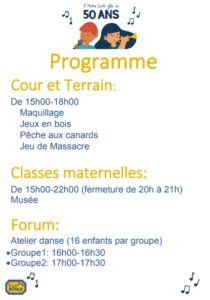
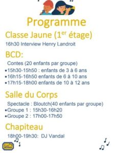
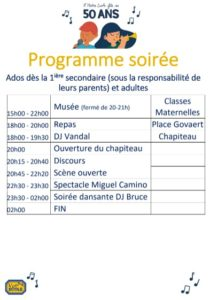

Vous êtes attendus à partir de 15h pour les animations de l’après-midi.

Il n’y a plus moyen de réserver vos repas et la soirée. **Il sera encore possible de payer l’entrée le soir même, si le chapiteau n’est pas plein.**

A partir de 19h30, nous remettrons en vente quelques tickets repas en fonction du stock des food trucks.

Voici le programme détaillé de la journée :

Ne manquez surtout pas l’interview d’Henry Landroit et les témoignages de quelques parents et anciens élèves à 16h30, dans la classe jaune. Le programme est la signalisation vous permettront de profiter au maximum de cette journée.

Au plaisir de vous voir.