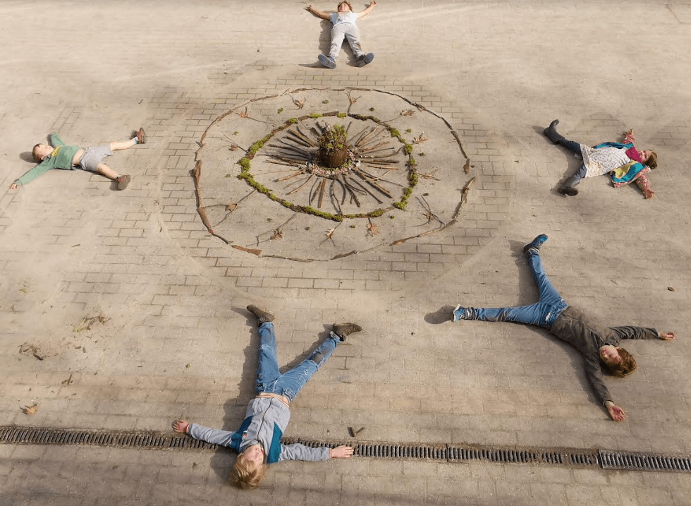
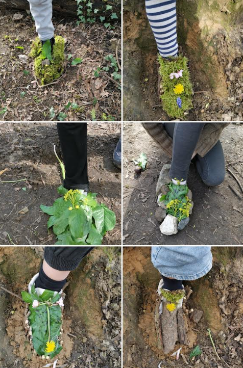

Souvent, le lundi après-midi, les enfants de la 3e maternelle à la 6e primaire participent à des ateliers interâges.

Ils s’inscrivent dans un atelier pour 5 à 6 semaines et découvrent et expérimentent des techniques diverses : cirque, danse, création de livres, terre, techniques d’impressions, bois, improvisation et plein d’autres choses encore. Une occasion de développer l’expression libre des enfants dans un domaine nouveau ou d’approfondir une technique.

Voici deux photos de l’atelier Land art de la semaine dernière…

